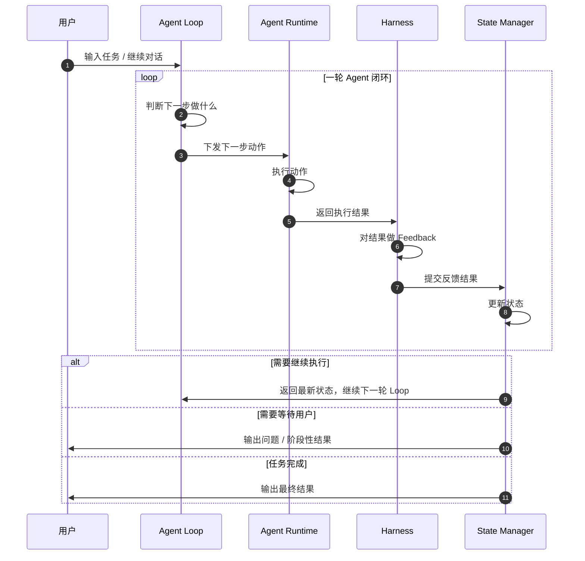

## Agent Runtime 设计流程

Runtime 就是 Agent 的执行器，里面负责 Agent 真正需要大模型参与的步骤。

这套 Runtime 的核心不是一次性回答用户，而是一个完整的 Agent Loop：



整体上可以拆成两个大步骤：

```text
第一步：Agent Loop
负责根据当前状态判断下一步 Action

第二步：Agent Runtime
负责执行 Action，并通过 Harness 更新下一轮 State
```

---

## 能力边界速览

### 首先是Loop外层边界

**1. 人设（Context Engineer）**

定义 Agent 是谁、承担什么职责、面对用户时是什么身份。

**2. 性格（Context Engineer）**

定义 Agent 的表达风格、沟通气质、回答偏好。

**3. 工具使用说明（Context Engineer）**

定义 Agent 当前可以使用哪些 Skill、工具、子 Agent，以及它们分别适合什么任务。

**4. 行为标准（Context Engineer）**

定义 Agent 的行为边界，例如：

```text
什么时候可以直接回答
什么时候需要调用 Skill
什么时候需要调用子 Agent
什么时候需要向用户追问
什么时候不能继续自动推进
```

**5. 长期 / 短期记忆（Context Engineer）**

提供当前任务相关的历史信息、用户偏好、项目背景、上下文状态。

这部分可以来自：

```text
长期记忆
短期会话历史
agentic rag 检索结果
项目文件
工具历史结果
```

---

## 然后看看核心概念：State 和 Action

在 Runtime 流程中，需要区分 State 和 Action。

- State：表示系统当前处于什么阶段
- Action：表示这一轮具体要执行什么动作

也就是：

- State = 现在走到哪一步
- Action = 下一步要干什么

### State 列表

| State | 含义 | 说明 |
| --- | --- | --- |
| new_request | 新请求 | 用户刚刚提出一个新问题，本轮任务刚开始 |
| ready_to_plan | 可继续规划 | Skill 或子 Agent 已经执行完成，结果可用，需要回到 Agent Loop 判断下一步 |
| missing_params | 缺少参数 | Runtime 或 Harness 判断当前任务缺少关键参数 |
| awaiting_user | 等待用户 | 已经向用户追问，等待用户补充信息 |
| completed | 已完成 | 已经完成最终回答，本轮 Loop 结束 |
| failed | 失败 | 无法继续自动推进，需要向用户说明失败原因 |

---

### Action 列表

| Action | 含义 | 说明 |
| --- | --- | --- |
| answer_user | 回答用户 | 当前上下文已经足够，可以生成最终回答 |
| call_skill | 调用 Skill | 当前问题需要 Skill 辅助完成 |
| call_agent | 调用子 Agent | 当前问题需要其他 Agent 辅助完成 |
| ask_user | 询问用户 | 当前缺少关键信息，且主 Agent 无法自行补齐，需要向用户追问 |

---

### 第一步：Agent Loop 判断下一步做什么

Agent Loop 是完整的模型自判断循环。

它的职责是：

> 根据当前 State，组装当前轮 Prompt，最后让大模型判断下一步 Action

Agent Loop 本身不直接执行工具，也不直接调用子 Agent。

它只回答两个个问题：

- 下一步应该做什么
- 下一轮的状态是什么

---

### Agent Loop 第一步：下一步干什么的会接收的状态

| 当前 State | 进入原因 | Prompt 重点 | 可能产出的 Action |
| --- | --- | --- | --- |
| new_request | 用户提出新请求 | 理解用户问题，判断是否需要工具或子 Agent | answer_user / call_skill / call_agent / ask_user |
| ready_to_plan | 上一轮 Skill 或子 Agent 执行成功 | 结合工具结果判断是否已经可以回答，还是继续执行 | answer_user / call_skill / call_agent / ask_user |
| missing_params | 上一轮执行发现缺少参数 | 判断主 Agent 能否自行补齐参数 | call_skill / call_agent / ask_user |
| awaiting_user | 用户补充了信息 | 将用户补充内容合并到 pending_action | answer_user / call_skill / call_agent / ask_user |

---

1. **State = new_request**

如果上一轮对话的 State 是 `new_request`，说明这是一个全新的用户请求。

此时系统需要组装一个新的 Prompt，用于判断下一步 Action。

要判断的是：

- 可以直接回答 answer_user
- 还是需要调用 Skill call_skill
- 还是需要调用其他 Agent call_agent
- 还是需要用户补充信息 ask_user

此状态的Prompt 组成

```text
1. Agent.md
2. Instruction.md
3. 长期 / 短期记忆，来自 agentic rag
4. 用户当前问题
5. 工具使用说明
6. Action 输出格式
```

可能产出的 Action

- ***answer_user***
- ***call_skill***
- ***call_agent***
- ***ask_user***

---

2. **State = ready_to_plan**

如果上一轮对话的 State 是 `ready_to_plan`，说明上一步 Skill 或子 Agent 已经执行完成，并且 Harness 判断结果可用。

此时系统需要重新判断下一步。

要判断的是：

- 当前工具结果是否已经足够回答用户
- 是否还需要继续调用 Skill
- 是否还需要继续调用其他 Agent
- 是否还需要问用户补充信息

此状态的Prompt 组成

```text
1. Agent.md
2. Instruction.md
3. 长期 / 短期记忆，来自 agentic rag
4. 用户当前问题
5. 工具使用说明
6. 上一次 pending_action
7. 上一轮工具结果 / 子 Agent 结果
8. Harness 评估结果
9. Action 输出格式
```

### 可能产出的 Action

- ***answer_user***
- ***call_skill***
- ***call_agent***
- ***ask_user***

---

3. **State = missing_params**

如果上一轮对话的 State 是 `missing_params`，说明上一轮 Runtime 执行过程中缺少关键参数。

这里不要立刻问用户，而是先判断：

> 主 Agent 能不能根据已有上下文补齐参数

- 如果主 Agent 能补齐参数，就继续调用 Skill 或子 Agent。
- 如果主 Agent 不能补齐参数，再向用户追问。

此状态Prompt 组成

```text
1. Agent.md
2. Instruction.md
2. 长期 / 短期记忆，来自 agentic rag
3. 用户当前问题
4. 缺失参数内容（通常上一轮harness提供）
5. 上一次 pending_action
6. 已有工具结果
7. Harness 评估结果
8. 工具使用说明
9. Action 输出格式
```

可能产出的 Action

- ***call_skill***
- ***call_agent***
- ***ask_user***

---

4. **State = awaiting_user**

如果上一轮对话的 State 是 `awaiting_user`，说明用户已经补充了信息。

此时系统需要做的是：

```text
读取用户补充内容
  ↓
读取上一次 pending_action
  ↓
将用户补充内容补充进 pending_action
  ↓
重新判断下一步 Action
```

此状态Prompt 组成

```text
1. Agent.md
2. Instruction.md
2. 用户当前补充内容
3. 上一次 pending_action
4. 缺失参数列表
5. 长期 / 短期记忆，来自 agentic rag
6. 用户原始问题
7. 工具使用说明
8. Action 输出格式
```

可能产出的 Action

- ***answer_user***
- ***call_skill***
- ***call_agent***
- ***ask_user***

---

## 第二步：Agent Runtime 执行 Action 并更新状态

Agent Loop 产出 Action 后，就会交给 Agent Runtime 执行。

Runtime 的职责是：

1. 执行 Action
2. 拿到执行结果
3. 交给 Harness 做 feedback
4. 根据 Harness 结果更新 State

Runtime 不负责重新判断下一步该做什么。

重新判断下一步，是下一轮 Agent Loop 的事情。

### Agent Runtime 阶段的动作执行表

| 当前 Action | Runtime 做什么 | 是否进入 Harness | 执行后 State |
| --- | --- | --- | --- |
| answer_user | 组装 Answer Prompt，生成最终回答 | 否 | completed |
| call_skill | 调用指定 Skill | 是 | ready_to_plan / missing_params / failed |
| call_agent | 调用指定子 Agent | 是 | ready_to_plan / missing_params / failed |
| ask_user | 向用户追问，并保存 pending_action | 否 | awaiting_user |

---

1. **Action = answer_user**

如果 Agent Loop 产出的 Action 是 `answer_user`，说明当前信息已经足够，可以直接回答用户。

此时进入 Answer Runtime。

Answer Prompt 组成如下：

```text
1. Agent.md
2. SOUL.md
3. Instruction.md
4. 长期 / 短期记忆，来自 agentic rag
5. 用户当前问题
6. 工具结果，如果有
7. 用户交互输出要求
```

Runtime 执行步骤

```text
组装 Answer Prompt
  ↓
调用大模型生成最终回答
  ↓
输出给用户
  ↓
State = completed
```

这里不额外增加 Final Harness。

因为在这个设计里，`answer_user` 本身就是 Agent Loop 判断后的最终动作。

---

2. **Action = call_skill**

如果 Agent Loop 产出的 Action 是 `call_skill`，说明当前问题需要 Skill 辅助完成。

Agent Loop 需要输出：

- ***skill 名称***
- ***skill 参数***
- ***调用原因***

Runtime 执行步骤

```text
读取 skill 名称
  ↓
读取 skill 参数
  ↓
校验参数是否完整
  ↓
调用 Skill
  ↓
获取 Skill 执行结果
  ↓
交给 Harness
```

Skill 执行可能返回

```text
success
partial_success
missing_params
failed
```

Skill 执行结果不会直接给用户，而是进入 Harness。

---

3. **Action = call_agent**

如果 Agent Loop 产出的 Action 是 `call_agent`，说明当前问题需要其他 Agent 辅助完成。

Agent Loop 需要输出：

- agent 名称
- 传递给 agent 的信息
- 希望 agent 完成的任务

Runtime 执行步骤

```text
读取 agent 名称
  ↓
读取传递给 agent 的信息
  ↓
组装子 Agent 上下文
  ↓
调用子 Agent
  ↓
获取子 Agent 执行结果
  ↓
交给 Harness
```

子 Agent 执行可能返回

```text
success
partial_success
missing_params
failed
```

子 Agent 的执行结果同样不会直接给用户，而是进入 Harness。

---

4. **Action = ask_user**

如果 Agent Loop 产出的 Action 是 `ask_user`，说明当前信息不足，并且主 Agent 无法自行补齐。

Agent Loop 需要输出：

```text
需要问用户的问题
缺少的关键参数
为什么必须由用户补充
上一轮未完成的 pending_action
```

Runtime 执行

```text
保存 pending_action
  ↓
保存 missing_params
  ↓
向用户提出问题
  ↓
State = awaiting_user
```

此时 Runtime 暂停，等待用户输入。

---

## Harness Feedback

Harness 是 Runtime 执行后的反馈器。

它只处理 Skill 和子 Agent 的执行结果。

```text
answer_user 不经过 Harness
ask_user 不经过 Harness
call_skill 和 call_agent 执行后进入 Harness
```

### Harness Prompt

```tex
1. Agent.md
2. Instruction.md
3. harness专属行为准则
3. 长期记忆、短期记忆
4. 用户问题
5. 工具结果
6. 输出结构
```

### Harness 阶段的状态更新表

| Runtime 结果 | Harness 判断 | 更新后的 State | 下一步 |
| --- | --- | --- | --- |
| success | 执行成功，结果可用 | ready_to_plan | 回到 Agent Loop 判断是否可以回答 |
| partial_success | 部分成功，结果可用但可能不完整 | ready_to_plan / missing_params | 回到 Agent Loop 或补参数 |
| missing_params | 缺少关键参数 | missing_params | 回到 Agent Loop 判断能否补齐 |
| failed | 执行失败，无法继续 | failed | 向用户说明失败原因 |

---

1. **Harness 输出 State = ready_to_plan**

表示 Skill 或子 Agent 执行结果可用。

但是是否已经满足用户问题，还需要回到 Agent Loop 判断。

流程是：

```text
Skill / 子 Agent 执行成功
  ↓
Harness 判断结果可用
  ↓
State = ready_to_plan
  ↓
回到 Agent Loop
  ↓
重新判断下一步 Action
```

---

2. **Harness 输出 State = missing_params**

表示当前任务继续推进还缺少关键参数。

这里要注意：

```text
missing_params 是 State
ask_user 是 Action
```

`missing_params` 不等于立刻问用户。

进入 `missing_params` 后，需要回到 Agent Loop 判断：

```text
主 Agent 能不能根据已有上下文补齐参数
```

如果能补齐，下一步 Action 是：

```text
call_skill
call_agent
```

如果不能补齐，下一步 Action 是：

```text
ask_user
```

---

3. **Harness 输出 State = failed**

表示 Runtime 执行失败，并且当前系统无法继续自动推进。

可能原因包括：

```text
工具不可用
子 Agent 调用失败
权限不足
参数无法获得
超过最大 Loop 次数
```

此时不再继续 Loop，而是向用户说明：

```text
当前执行到了哪一步
已经完成了什么
失败原因是什么
为什么不能继续自动推进
用户可以如何补充信息或手动处理
```

---

## Loop 结束

当 Agent Loop 判断出：

```text
Action = answer_user
```

Runtime 会生成最终回答。

回答完成后：

```text
State = completed
```

本轮 Loop 结束。

---

## 防死循环机制

由于 Agent Loop 可能多次执行：

```text
Agent Loop
  ↓
Runtime
  ↓
Harness
  ↓
Agent Loop
```

所以必须设置最大 Loop 轮数。

建议：

```text
max_loop_steps = 5
```

每完成一次：

```text
Agent Loop -> Runtime -> Harness
```

记为一轮。

如果超过 5 轮仍然没有进入：

```text
State = completed
```

则强制进入：

```text
State = failed
```

此时系统不再继续自动调用 Skill 或 Agent，而是输出阶段性结果。

输出内容包括：

```text
当前已经完成了什么
卡在哪一步
为什么不能继续自动推进
是否缺少用户参数
建议用户下一步怎么做
```

---

## 最终闭环

```text
用户输入
  ↓
State = new_request
  ↓
Agent Loop 判断 Action
  ↓
Runtime 执行 Action
  ↓
如果 Action = answer_user
      ↓
      生成最终回答
      ↓
      State = completed
      ↓
      结束
  ↓
如果 Action = call_skill
      ↓
      Runtime 调用 Skill
      ↓
      Harness 评估结果
      ↓
      State = ready_to_plan / missing_params / failed
      ↓
      回到 Agent Loop 或结束
  ↓
如果 Action = call_agent
      ↓
      Runtime 调用子 Agent
      ↓
      Harness 评估结果
      ↓
      State = ready_to_plan / missing_params / failed
      ↓
      回到 Agent Loop 或结束
  ↓
如果 Action = ask_user
      ↓
      向用户追问
      ↓
      State = awaiting_user
      ↓
      用户补充信息后继续 Loop
```

---

## 一句话总结

Runtime 的本质是：

1. Agent Loop 根据当前 State 判断下一步 Action；
2. Agent Runtime 执行 Action；
3. Harness 评估 Skill / 子 Agent 的执行结果；
4. State Manager 根据结果更新 State；
5. 系统根据 State 决定继续 Loop、等待用户、完成回答或失败退出。